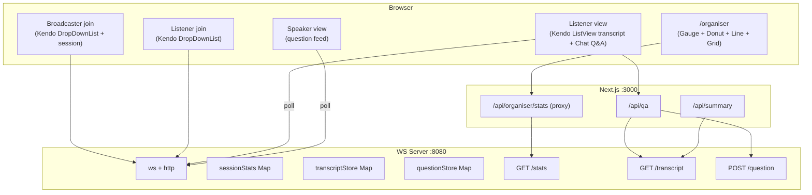

# Design Document

## Overview

This design turns PolyDub into **Unison**, a conference inclusion platform, by layering five capabilities onto the existing Next.js + WebSocket architecture:

1. **Rebrand** PolyDub → Unison in user-facing surfaces.
2. **Kendo UI** components themed to the existing dark baltic-sea/keppel palette.
3. **Conference event layer** (`lib/event-config.ts`) tying broadcasts to sessions.
4. **Organiser dashboard** (`/organiser`) backed by a new stats endpoint on the WS server.
5. **AI Q&A loop** (attendee → Claude grounded in live transcript → attendee, plus speaker question feed) and an optional **post-talk summary**.

The existing real-time pipeline (Deepgram STT → Google translate → Deepgram Aura TTS over WS) is preserved. New server state (per-session listener tracking, transcript store, question store) is added to `server/index.ts`, exposed through plain HTTP endpoints on the same `http.Server` that already hosts the WS upgrade.



## Architecture Decisions

### Where new server state lives
The WS server (`server/index.ts`) already owns all real-time room state. The organiser dashboard and Q&A need that same state, so the WS server is extended with:
- HTTP GET `/stats` — aggregated organiser stats.
- HTTP GET `/transcript?session=<id>&seconds=90` — recent transcript for grounding.
- HTTP POST `/question` — record an attendee question (English) for the speaker feed.
- HTTP GET `/questions?session=<id>` — speaker polls questions.

These are added inside the existing `http.createServer` request handler (currently returns a plain text status). This avoids a second process and keeps all room knowledge in one place.

**CORS:** The Next.js app (`:3000`) calls these from server components / route handlers and from the browser dashboard. Add permissive CORS headers (`Access-Control-Allow-Origin: *`) to the WS server's HTTP responses since it's a demo tool.

### Why a Next.js proxy for stats
`/api/organiser/stats` in Next.js fetches the WS server `/stats` server-side. This keeps the browser pointing at one origin and lets us inject mocked/demo data (Requirement 12.3) without changing the WS server. The dashboard polls `/api/organiser/stats`.

### Session model
Broadcasts are keyed by `broadcastId` today. We introduce a **sessionId** that equals the chosen conference session id (e.g., `keynote`). The broadcaster uses the session id as the broadcast id, so existing `?id=` plumbing carries the session id end-to-end. The listener URL becomes `/live/[sessionId]/[language]` (a new route, chosen to avoid a Next.js dynamic-slug conflict with the existing `/room/[roomId]` multi-party feature) while the legacy `/broadcast/[id]/[lang]` route remains for backward compatibility.

### Claude integration
Use `@ai-sdk/anthropic` + `ai` `generateText`. Model: `claude-3-5-haiku-latest` for low-latency Q&A, `claude-3-5-sonnet-latest` for the richer summary. If `ANTHROPIC_API_KEY` is missing, the routes return a graceful fallback message rather than 500.

## Kendo Theming Strategy

Kendo's default theme is light. The site is dark (baltic-sea surfaces, keppel accent, radius 0.75rem). Approach:

1. Import `@progress/kendo-theme-default/dist/all.css` globally in `app/layout.tsx`.
2. Add a scoped override stylesheet `app/kendo-theme.css` (imported after the Kendo CSS) that maps Kendo CSS variables to the existing theme tokens. Kendo v15 exposes CSS custom properties like `--kendo-color-primary`, `--kendo-color-surface`, `--kendo-color-on-app-surface`, `--kendo-border-radius`, etc.

```css
:root {
  --kendo-color-primary: var(--color-keppel-500);
  --kendo-color-primary-hover: var(--color-keppel-400);
  --kendo-color-base: var(--color-baltic-sea-900);
  --kendo-color-on-base: var(--color-baltic-sea-100);
  --kendo-color-surface: var(--color-baltic-sea-900);
  --kendo-color-surface-alt: var(--color-baltic-sea-950);
  --kendo-color-border: var(--color-baltic-sea-700);
  --kendo-component-bg: var(--color-baltic-sea-900);
  --kendo-component-text: var(--color-baltic-sea-100);
  --kendo-border-radius-md: 0.75rem;
  /* chart series palette aligned to keppel/baltic */
}
```
3. Wrap Kendo-heavy areas in a `k-unison` class for any selectors that need higher specificity to defeat the default theme (e.g., popups rendered in a portal get the class on `document.body` via a small effect, or we target `.k-list-container`, `.k-animation-container` globally).
4. Charts: pass an explicit `seriesColors`/series `color` derived from the keppel + baltic palette so DonutChart/LineChart match.

This satisfies Requirement 2 (no clashing default blue/light) while leaving existing Radix/Tailwind pages untouched (overrides only affect `.k-*` Kendo classes).

## Components and Interfaces

### 1. Rebrand (Requirement 1)
- `app/layout.tsx`: metadata title → "Unison | Real-Time Conference Dubbing".
- `components/header.tsx`: brand text "PolyDub" → "Unison", alt text.
- `app/broadcast/[id]/[lang]/page.tsx`: "PolyDub Live" → "Unison Live"; recording filename prefix `unison-`.
- Other user-facing "PolyDub" strings replaced. `package.json` name left as-is (non-user-facing) to avoid risk.

### 2. Event config (Requirement 5)
`lib/event-config.ts`:
```ts
export interface ConferenceSession {
  id: string; name: string; speaker: string; startTime: string;
}
export const EVENT_CONFIG = {
  name: "React Summit / JSNation 2026",
  sessions: [
    { id: "keynote", name: "Keynote: The Future of React", speaker: "TBD", startTime: "09:00" },
    { id: "workshop-1", name: "Workshop: AI-Powered UX", speaker: "TBD", startTime: "11:00" },
    { id: "panel", name: "Panel: Open Source in 2026", speaker: "Multiple", startTime: "14:00" },
  ] as ConferenceSession[],
};
export function getSession(id: string): ConferenceSession | undefined;
```

### 3. Kendo language selector (Requirement 3)
New `components/polydub/kendo-language-select.tsx`:
- Props: `value: string`, `onChange: (code) => void`, `languages: {code,name,flag}[]`, `label?`, `disabled?`.
- Uses `DropDownList` with `itemRender` and `valueRender` showing `flag + name`.
- Reuses the `STT_LANGUAGES` / `TTS_LANGUAGES` lists exported from the existing selector (lists moved to `lib/languages.ts` to avoid circular imports).
- Used on the new `/room` listener join screen and as the source-language picker on the broadcaster. The broadcaster's multi-target voice grid is retained.

### 4. Kendo transcript ListView (Requirement 4)
New `components/polydub/kendo-transcript-list.tsx`:
- Props: `entries: {original, translated, timestamp}[]`.
- `ListView` with `item` template: `[time] original → translated`.
- Auto-scroll: `useEffect` on `entries.length` scrolls the list container ref to bottom.
- Empty state component when no entries.
- Rendered on the listener view (`/room/[sessionId]/[language]`).

### 5. Session info card (Requirement 5)
New `components/polydub/session-info-card.tsx` using Kendo layout `Card`/`TileLayout`:
- Shows session name, speaker, current language (flag+name), live attendee count.
- Attendee count from polling `/api/organiser/stats` filtered to the session, or a lighter `GET /stats`.

### 6. Server state additions (Requirements 6, 8, 10)
In `server/index.ts`:
```ts
interface SessionStat {
  sessionId: string;
  listeners: Map<string, Set<WebSocket>>; // lang -> sockets (reuse broadcast listeners)
  peak: number;
  history: { t: number; count: number }[]; // rolling, sampled every ~5s, last 10 min
}
const sessionStats = new Map<string, SessionStat>();

interface TranscriptEntry { t: number; original: string; translated: string; lang: string; }
const transcriptStore = new Map<string, TranscriptEntry[]>(); // sessionId -> last 200

interface QuestionEntry { id: string; t: number; text: string; lang: string; } // text in English
const questionStore = new Map<string, QuestionEntry[]>(); // sessionId -> last 50
```
- Listener join/leave updates `sessionStats` (current count, peak).
- A 5s interval samples each session's total listener count into `history`, trimming to the last 120 samples (~10 min).
- The host `onTranscript` final branch pushes `{original, translated(en or first target), lang}` to `transcriptStore[sessionId]`, capped at 200.
- `POST /question` appends to `questionStore[sessionId]`, capped at 50.

HTTP routes computed from this state:
- `GET /stats` → the organiser payload (see Data Models).
- `GET /transcript?session&seconds` → entries within window.
- `GET /questions?session` → recent questions.
- `POST /question` → `{ sessionId, text(English), lang }`.

### 7. Organiser dashboard (Requirement 7)
New `app/organiser/page.tsx` (client component):
- Access gate: read `?key=` via `useSearchParams`; render dashboard only if `key === "demo"` (configurable constant). Otherwise a simple password prompt.
- Polls `/api/organiser/stats` every 5s with `setInterval`, stores in state.
- Layout (Kendo + Tailwind grid):
  - **RadialGauge** hero: `reachPercentage`. With/without framing text computed from stats.
  - **DonutChart**: `listenersByLanguage`. Custom `seriesColors`. Center label = breakdown string.
  - **LineChart**: one series per session from `listenersBySession[].history`. Category axis = time.
  - **Grid**: `listenersBySession` rows → columns Session Name, Active Listeners, Languages, Peak, Status.
  - **ListView** (questions) when present.
- Independent error boundaries: each widget guards against missing data; a fetch failure shows a retry banner but keeps last data.
- Demo seed: if `?demo=1` or stats empty, use a seeded mock dataset so the dashboard is visually populated.

`app/api/organiser/stats/route.ts`: fetches `${STATS_URL}/stats`, returns JSON; on failure returns seeded/empty payload.

### 8. Q&A layer (Requirement 9, 10)
- `components/polydub/qa-chat.tsx`: collapsible right-side panel using `Chat` from `@progress/kendo-react-conversational-ui`. Local message list; on send, POST `/api/qa` `{question, language, sessionId}`; show pending bot typing; append bot answer or error message.
- `app/api/qa/route.ts`:
  1. Translate question → English (reuse `TranslationService`).
  2. `GET ${STATS_URL}/transcript?session=<id>&seconds=90`.
  3. `generateText` with Claude haiku using the grounding prompt.
  4. Translate answer → attendee language.
  5. `POST ${STATS_URL}/question` with English question (for speaker feed).
  6. Return `{ answer }`.
  - Missing key / failure → `{ answer: "<friendly message>" }` (200) so the chat never crashes.
- Speaker question feed `components/polydub/speaker-questions.tsx`: polls `/api/organiser/questions?session=<id>` (Next proxy → WS `/questions`) every 4s; renders list. Added to broadcaster page.

### 9. Post-talk summary (Requirement 11, optional)
- `app/api/summary/route.ts`: `GET transcript (full, large window)`, `generateText` with sonnet producing JSON `{ takeaways[], technologies[], snippets[] }`. Graceful fallback.
- `components/polydub/summary-window.tsx`: Kendo `Window` overlay with the content + a "Download .md" button (Blob download). Triggered by an "End Session" button on the broadcaster.

## Data Models

Organiser stats payload (`GET /stats` and `/api/organiser/stats`):
```ts
interface OrganiserStats {
  totalListeners: number;
  listenersByLanguage: { language: string; count: number }[];
  listenersBySession: {
    sessionId: string; name: string; count: number; peak: number;
    languages: string[]; history: number[]; status: "live" | "idle";
  }[];
  reachPercentage: number;       // 0..100
  activeLanguages: string[];
  assumedNonEnglishBaseline: number; // for the "without Unison" framing
}
```
`reachPercentage = round(servedListeners / (servedListeners + baseline) * 100)`, where `servedListeners = totalListeners` and `baseline` is a configurable demo constant (e.g., proportion of non-English attendees). For the hero framing: "Without Unison: <englishOnly> of <total> could follow" vs "With Unison: <total> of <total>".

## Error Handling

- **WS HTTP routes**: wrap handlers in try/catch, always return JSON, include CORS headers. Unknown paths → 404 JSON.
- **/api/qa, /api/summary**: never throw to client; return a friendly `answer`/message with 200. Log server-side.
- **Dashboard**: poll wrapped in try/catch; on error keep prior state + show non-blocking banner; auto-retry next tick.
- **Q&A chat**: failed request appends an error bot bubble.
- **Listener view**: existing pipeline errors already non-fatal; transcript ListView and Chat are independent components so one failing does not break the other (Requirement 12.2).
- **Missing ANTHROPIC_API_KEY**: routes detect and return "AI Q&A isn't configured" style message.

## Testing Strategy

Given hackathon time constraints and no existing test harness, verification is primarily manual + build-based:
- `pnpm build` must pass (type checks the new routes/components).
- `pnpm server` boots and `GET /stats` returns well-formed JSON with no sessions (empty case, Requirement 6.6).
- Manual demo run through the script: broadcaster picks session, listener joins in Hindi, transcript ListView updates, organiser dashboard shows gauge/donut/line/grid, Q&A round-trips, speaker sees English question.
- Seeded demo dataset path validated by loading `/organiser?key=demo&demo=1`.

Lightweight unit checks (optional, only if time remains): pure helpers like `reachPercentage` computation and transcript window filtering.
