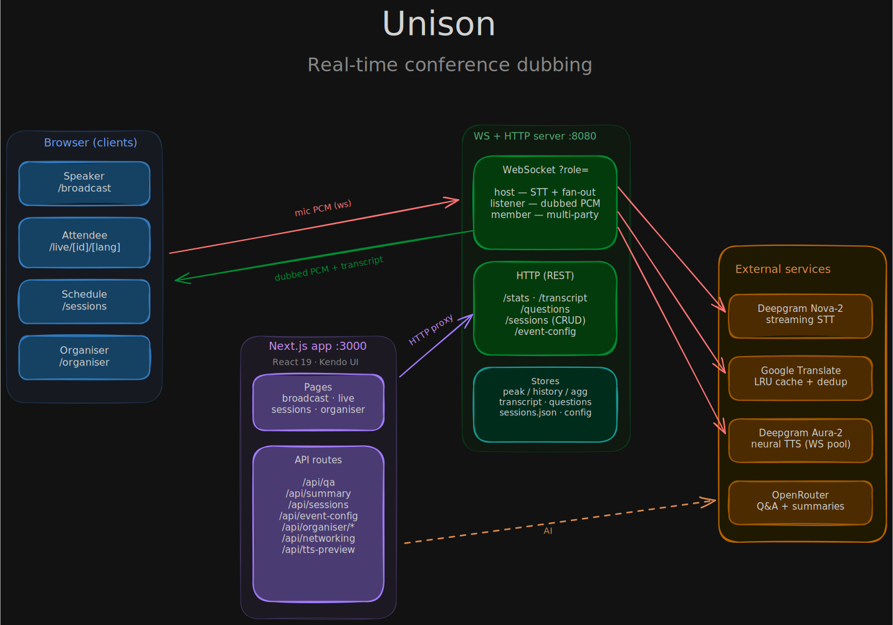
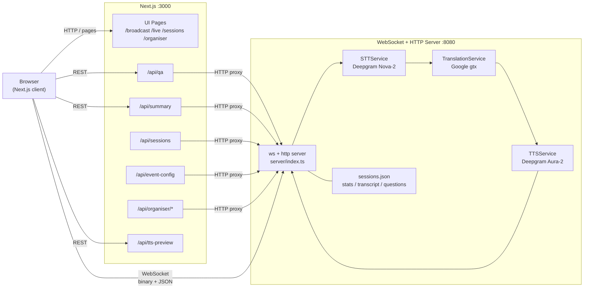
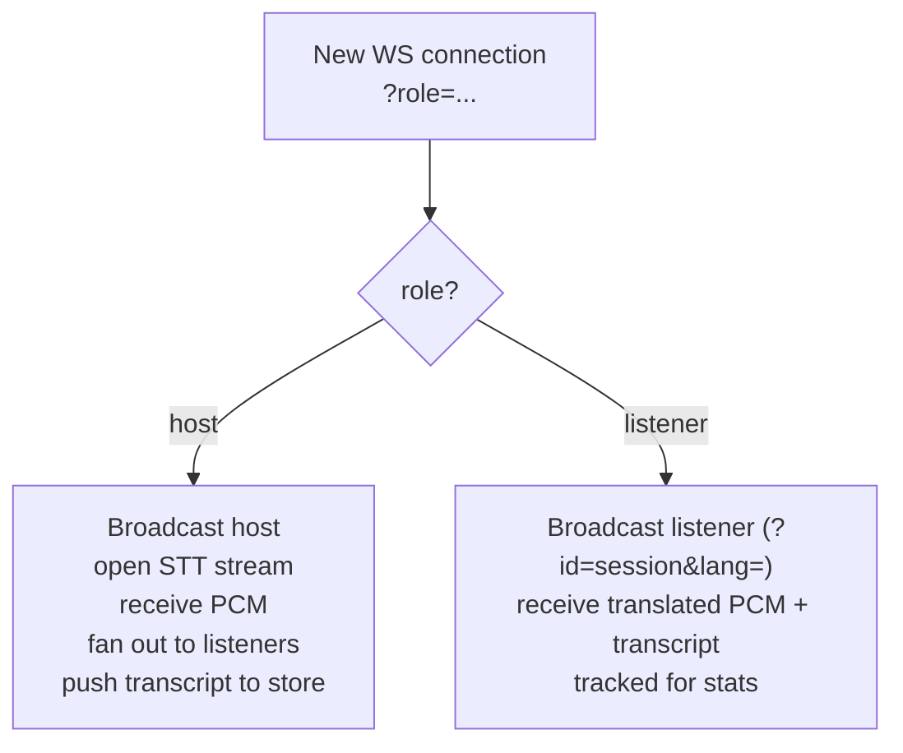
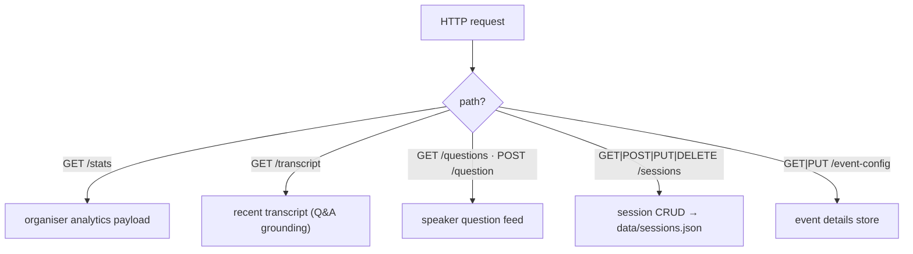
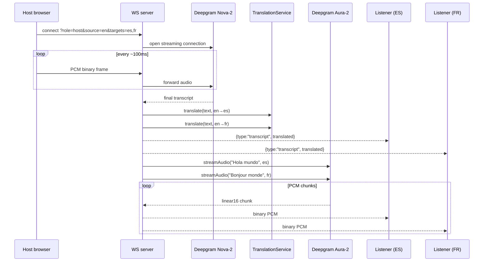
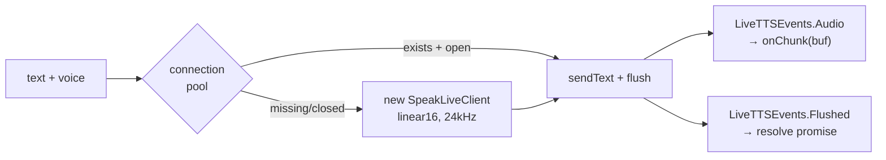
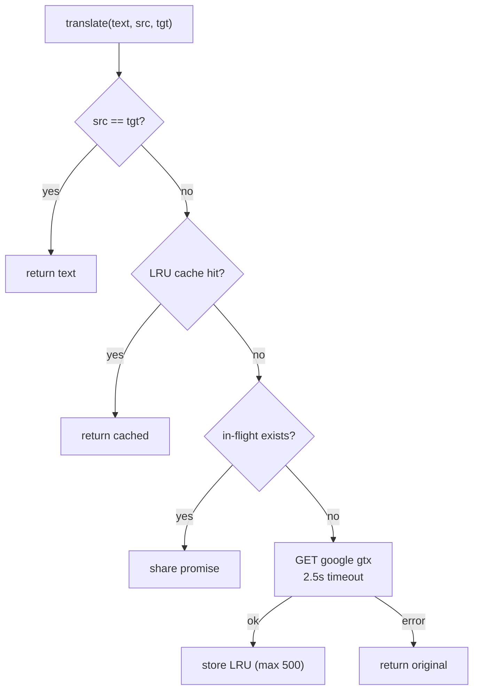
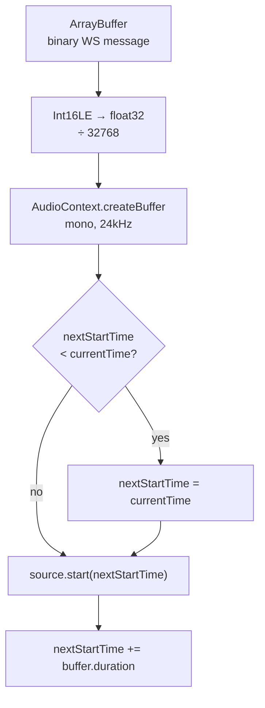
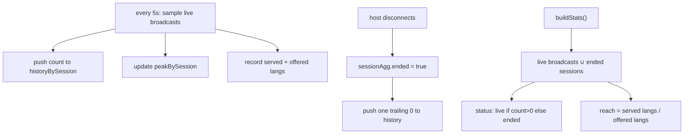

# Unison Architecture

  

## System Overview

Two processes run simultaneously:

---

## WebSocket Role Routing

The server also serves plain HTTP on the same port:

---

## Broadcast Flow

---

## TTS Service: Persistent WebSocket Pool

Each voice model gets one persistent `SpeakLiveClient` connection. `sendText()` + `flush()` streams audio chunks back via `LiveTTSEvents.Audio`, eliminating per-sentence HTTP round-trips.

---

## Translation Service

---

## Browser Audio Playback

---

## Organiser Stats Lifecycle

Stats survive a talk ending so the dashboard keeps showing real numbers
instead of falling back to demo data. A per-session aggregate (offered
languages, served languages, ended flag) persists after the host
disconnects; peak and history are kept in their own maps.

Reach is a language-coverage ratio (distinct languages that had a
listener over distinct languages the host offered), not a hardcoded
100%. Ended sessions keep their real peak and frozen history curve.

---

## Environment Variables

| Variable | Purpose |
|----------|---------|
| `DEEPGRAM_API_KEY` | STT and TTS |
| `NEXT_PUBLIC_WS_URL` | WebSocket server address |
| `NEXT_PUBLIC_STATS_URL` | WS server HTTP base for organiser/session APIs |
| `PORT` / `WEBSOCKET_PORT` | WS listening port (default 8080) |
| `OPENROUTER_API_KEY` | AI Q&A and session summaries |
| `OPENROUTER_QA_MODEL` | Q&A model slug (default `openai/gpt-4o-mini`) |
| `OPENROUTER_SUMMARY_MODEL` | Summary model slug (default `anthropic/claude-sonnet-4`) |
| `ENABLE_DEBUG_ROUTES` | Set `1` to enable `POST /debug/transcript` |
