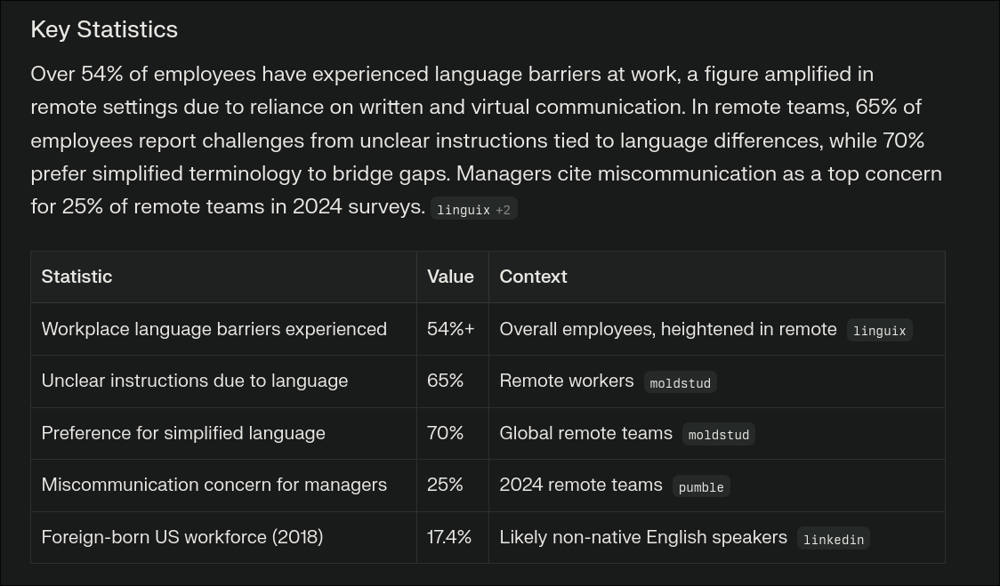
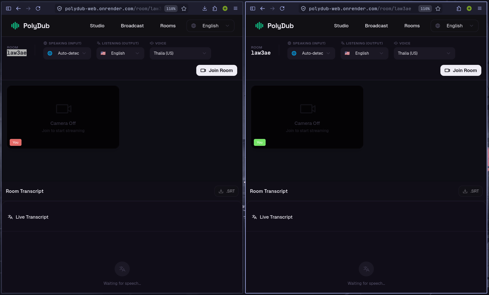

<div align="center">
  

  # Unison

  **Real-Time Conference Dubbing**

  > Every attendee. Every language. Live.

[](https://nextjs.org/)
[](https://react.dev/)
[](https://www.typescriptlang.org/)
[](https://www.telerik.com/kendo-react-ui)
[](https://deepgram.com/)

</div>

Unison is **conference inclusion infrastructure**. A speaker talks on stage in their language; every attendee hears and reads the talk in their own, live, with no hardware, no app install, and no human interpreters. Attendees can ask questions in their native language and the speaker receives them in English, closing a two-way loop.

Built for the **Progress x GitNation Hackathon** with Kendo UI for React across the entire attendee and organiser experience.

<!-- ─────────────────────────────────────────────────────────────────────────
     SCREENSHOT: landing / hero
     ───────────────────────────────────────────────────────────────────────── -->
<div align="center">
  
</div>

## The Problem

<div align="center">
  
</div>

At a global conference, most of the room hears a talk in a language that isn't their first. Slides translate; speakers don't. Unison closes that gap instantly, for everyone, without interrupting the speaker.

## Features

| Surface | Route | What it does |
|---------|-------|--------------|
| Live Broadcast | `/broadcast` | Speaker goes live; attendees get translated audio plus a live transcript. Per-language listener links with copy buttons, and incoming audience questions shown in English. |
| Attendee View | `/live/[sessionId]/[language]` | Join a session in your language: dubbed audio, Kendo transcript feed, AI Q&A chat, post-talk summary, and interest-based networking. |
| Session Schedule | `/sessions` | Browse the conference schedule with live / upcoming / ended status and join any talk in your language. |
| Organiser Dashboard | `/organiser?key=demo` | Language-reach gauge, language distribution donut, listeners-over-time line chart, sessions grid, recent questions, plus inline session CRUD and event settings. |

**Highlights:**

- Real-time speech → translation → neural voice pipeline with ~3s end-to-end latency
- Deepgram Nova-2 streaming STT and Aura-2 neural TTS (native voices for EN, ES, FR, DE, IT, JA, NL)
- Google Translate with an LRU cache and in-flight request deduplication
- AI-powered attendee Q&A, grounded strictly in the live transcript, via OpenRouter
- Auto-generated post-talk summaries (key takeaways, technologies, code snippets)
- Interest-based attendee networking with live match notifications
- Organiser analytics on Kendo Charts, Gauges and Grid: real ended-session stats (peak + history retained after a talk ends) and language-coverage reach
- Configurable event details and inline session management, persisted server-side
- Rotating dotted-globe landing page (cobe / WebGL)

## Screenshots

### Live Broadcast (Speaker)

<div align="center">
  
</div>

### Attendee View

<div align="center">
  
</div>

### Organiser Dashboard

<!-- ─────────────────────────────────────────────────────────────────────────
     SCREENSHOT: organiser dashboard — replace with a fresh capture of
     /organiser?key=demo showing the reach gauge, donut, and line chart.
     ───────────────────────────────────────────────────────────────────────── -->
<div align="center">
  <!-- TODO: add public/organiser.png and reference it here -->
  
</div>

## How It Works

```text
Mic PCM ──ws──▶ Deepgram Nova-2 STT
            ──▶ Google Translate (per target language)
            ──▶ Deepgram Aura-2 TTS
            ──ws──▶ Browser AudioContext ──▶ Attendee hears dubbed audio
```

Two cooperating processes:

```text
Next.js app (:3000)              WebSocket + HTTP server (:8080)
  /broadcast                       broadcast hosts & listeners
  /live/[sessionId]/[language]     Deepgram streaming STT
  /sessions                        translation cache
  /organiser                       Aura-2 TTS
  /api/qa, /api/summary            session store (data/sessions.json)
  /api/sessions, /api/networking   stats / transcript / question stores
  /api/organiser/*                 event-config store
  /api/event-config, /api/tts-preview
```

The WS server also exposes plain HTTP endpoints (stats, transcript, questions, sessions and event-config CRUD) consumed by the Next.js API routes.

## Tech Stack

- **App**: Next.js 16, React 19, TypeScript
- **UI**: Tailwind CSS v4, **Kendo UI for React** (DropDownList, Grid, Charts, Gauges, ListView, Chat, Dialog, Window, Indicators, Notification, ProgressBar, Tooltip), Radix primitives, Phosphor Icons, cobe
- **Realtime**: Node.js, `ws`, browser Web Audio APIs
- **STT**: Deepgram Nova-2 streaming
- **Translation**: Google Translate `gtx` endpoint with LRU cache
- **TTS**: Deepgram Aura-2 (persistent `speak.live` WebSocket + REST fallback)
- **AI**: OpenRouter (Q&A answers + post-talk summaries)
- **Tests**: Vitest unit suite for core utilities

## Prerequisites

- Node.js 18+ (tested on 20–26)
- pnpm
- [Deepgram API key](https://console.deepgram.com)
- [OpenRouter API key](https://openrouter.ai/keys) (optional, enables Q&A + summaries)

## Getting Started

```bash
git clone https://github.com/crypticsaiyan/Unison.git
cd Unison
pnpm install
```

Create `.env`:

```env
DEEPGRAM_API_KEY=your_deepgram_api_key
NEXT_PUBLIC_WS_URL=ws://localhost:8080
NEXT_PUBLIC_STATS_URL=http://localhost:8080
WEBSOCKET_PORT=8080

# Optional, enables AI Q&A and post-talk summaries
OPENROUTER_API_KEY=your_openrouter_key
OPENROUTER_QA_MODEL=openai/gpt-4o-mini
OPENROUTER_SUMMARY_MODEL=anthropic/claude-sonnet-4
```

Start both processes in separate terminals:

```bash
pnpm server   # WebSocket + HTTP server on :8080
pnpm dev      # Next.js app on :3000
```

Open [http://localhost:3000](http://localhost:3000).

> **Note:** if you have an `OPENROUTER_API_KEY` exported in your shell, it overrides the one in `.env`. `unset` it (or keep them in sync) before running.

## Scripts

| Command | Description |
|---------|-------------|
| `pnpm dev` | Next.js dev server on `http://localhost:3000` |
| `pnpm server` | WebSocket + HTTP server on port `8080` |
| `pnpm build` | Build the Next.js app |
| `pnpm start` | Start the built Next.js app |
| `pnpm lint` | Run ESLint |
| `pnpm test` | Run the Vitest unit suite |
| `node scripts/test-llm.mjs` | Quick OpenRouter connectivity check (reads `.env`) |

## Environment Variables

| Variable | Required | Description |
|----------|----------|-------------|
| `DEEPGRAM_API_KEY` | Yes | Deepgram STT and TTS |
| `NEXT_PUBLIC_WS_URL` | Yes | WebSocket server URL (`ws://localhost:8080` in dev) |
| `NEXT_PUBLIC_STATS_URL` | Yes | WS server HTTP base for organiser/session APIs |
| `WEBSOCKET_PORT` / `PORT` | No | WS server port, defaults to `8080` |
| `OPENROUTER_API_KEY` | No | Enables AI Q&A and post-talk summaries |
| `OPENROUTER_QA_MODEL` | No | OpenRouter model slug for Q&A (defaults to `openai/gpt-4o-mini`) |
| `OPENROUTER_SUMMARY_MODEL` | No | OpenRouter model slug for summaries (defaults to `anthropic/claude-sonnet-4`) |
| `ENABLE_DEBUG_ROUTES` | No | Set to `1` to enable `POST /debug/transcript` (seed transcript without a live mic) |

## Project Structure

```text
app/
  broadcast/                      Live broadcast host page
  live/[sessionId]/[language]/    Attendee listener page (transcript + Q&A + networking)
  sessions/                       Conference schedule
  organiser/                      Organiser analytics dashboard + inline session CRUD
  api/
    qa/                           Translate → OpenRouter (grounded) → translate back
    summary/                      Post-talk summary generation
    sessions/                     Sessions CRUD proxy → WS server
    event-config/                 Event details proxy → WS server
    networking/                   Interest-based attendee matching
    organiser/                    Stats / questions proxies
    tts-preview/                  Voice preview
components/
  ui-core/                        Core product UI (Kendo + custom)
  ui/                             Shared Radix-based primitives
  dot-globe.tsx                   Rotating WebGL globe (cobe)
  header.tsx, footer.tsx, landing-page.tsx
hooks/                            use-websocket, use-sessions
lib/                              languages, event-config, llm (OpenRouter), srt, utils
server/                           WebSocket + HTTP server, STT/TTS/translate wrappers
data/                             Runtime session store (sessions.json, git-ignored)
```

## License

MIT
